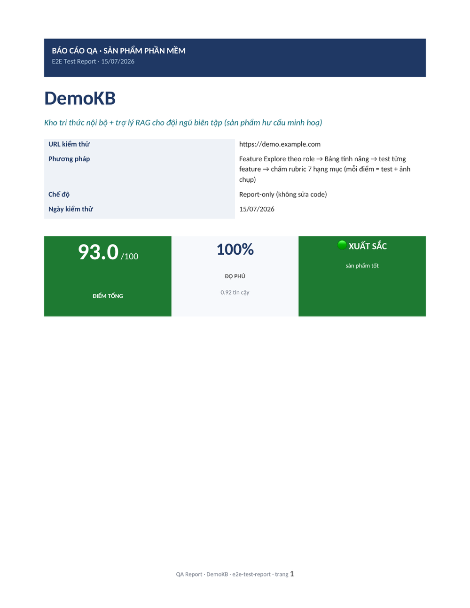
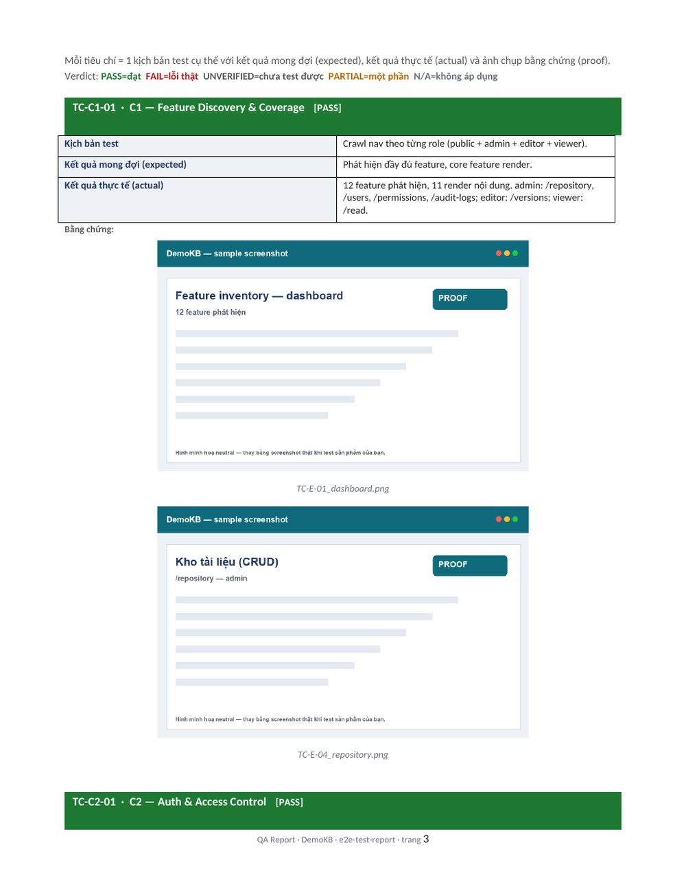
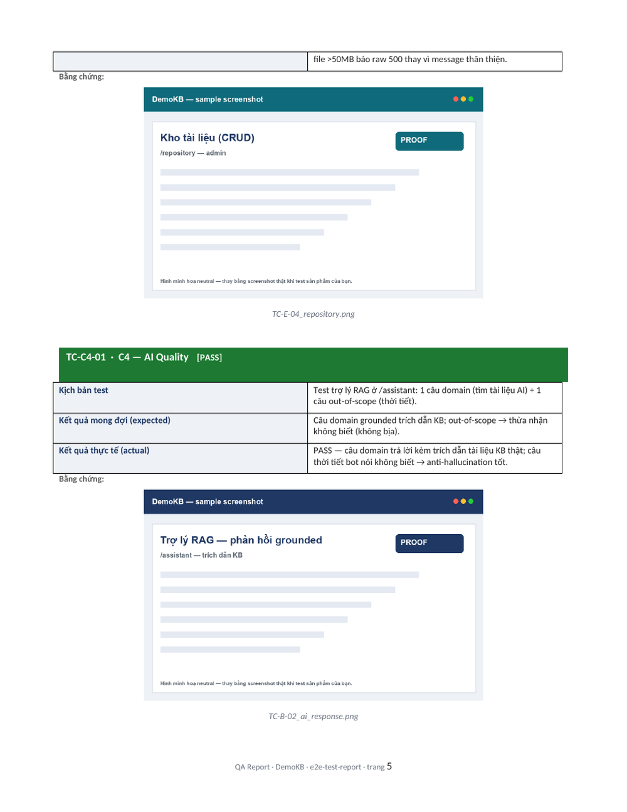

# E2E Test Report for Vibe Coding

> **Một skill + bộ harness để kiểm thử end-to-end bất kỳ sản phẩm vibe coding nào — và tự sinh ra một báo cáo QA đẹp, chính xác, có bằng chứng ở chuẩn excellence.**
>
> *"Không tin lời nói — chỉ tin kết quả test — và trình bày bằng chứng ở chuẩn excellence."*

`e2e-test-report` là một **agent skill** (SKILL.md) chạy trong các client AI coding (Claude Code, Codex, Antigravity). Nó biến câu lệnh *"test sản phẩm X có hoạt động không"* thành một **báo cáo QA chuyên nghiệp** (DOCX + PDF) với: ma trận test 5 tầng, rubric chấm điểm 7 tiêu chí có trọng số, bảng feature inventory, card test chi tiết từng tiêu chí, và ảnh proof embedded.

Đặc biệt mạnh với **sản phẩm có AI/chatbot/RAG**: báo cáo có 2 trục song song — Trục A (QA hệ thống /100) + Trục B (độ chính xác AI, đối chiếu ground truth, phát hiện hallucination).

---

## Báo cáo mẫu trông thế nào?

Đây là báo cáo thực sự do skill sinh ra (sản phẩm hư cấu `DemoKB`, dữ liệu mẫu — không phải ảnh mockup):

<p align="center">
  
  &nbsp;
  
</p>

<p align="center">
  <em>Trái: trang bìa với score badge màu theo band. Phải: bảng điểm rubric C1-C7 color-coded + tổng aggregate.</em>
</p>

<p align="center">
  
</p>

<p align="center">
  <em>Mỗi tiêu chí = 1 card: kịch bản test / kết quả mong đợi / kết quả thực tế / verdict + ảnh proof embedded. Đây là phần thuyết phục nhất — không chỉ đưa điểm suông.</em>
</p>

Mở file thật để xem đầy đủ: [`e2e-test-report/samples/QA-Report-Sample.docx`](e2e-test-report/samples/QA-Report-Sample.docx) · [`QA-Report-Sample.pdf`](e2e-test-report/samples/QA-Report-Sample.pdf)

---

## Tại sao cần skill này?

Sản phẩm vibe coding thường được build nhanh bởi AI — nhưng *"có vẻ hoạt động"* không đủ. Skill này giải 3 vấn đề:

| Vấn đề | Cách skill giải quyết |
|--------|----------------------|
| **AI-report tự khen** — báo cáo nói "tốt" mà không có test | Mỗi nhận định PHẢI có bằng chứng: test case + screenshot + 1 câu rationale dựa kết quả thật |
| **Test hời hợt** — chỉ test homepage + login rồi kết luận | BẮT BUỘC Feature Explore: crawl nav theo từng role → lập Feature Inventory → test từng feature |
| **Chấm AI sai** — tưởng chatbot "thông minh" khi thực ra trả greeting canned | Trục B: gửi ≥2 câu khác nhau, đối chiếu ground truth, phân biệt generative vs scripted |

### Khái niệm cốt lõi: "Không test được" ≠ "Bị hỏng"

Đây là ranh giới quan trọng nhất. Nếu test-runner không vào được trang / không có account / SPA chưa render → ghi **UNVERIFIED**, KHÔNG BAO GIỜ ghi FAIL. Skill đi kèm bộ kỹ thuật harness để chứng minh lỗi là của phần mềm, không phải của test-runner.

---

## Cài đặt

### Yêu cầu

- Một agent client hỗ trợ SKILL.md (xem dưới)
- Python 3.10+ + packages:
  ```bash
  pip3 install --break-system-packages python-docx playwright
  python3 -m playwright install chromium
  ```
- LibreOffice (`soffice`) — chỉ cần khi muốn đổi report ra PDF (optional)

### 1. Claude Code *(khuyến nghị)*

```bash
# Lấy skill về
git clone https://github.com/hailoc12/e2e_test_report_for_vibe_coding.git
cd e2e_test_report_for_vibe_coding

# Personal (mọi project)
cp -R e2e-test-report ~/.claude/skills/

# hoặc project-only
cp -R e2e-test-report .claude/skills/
```

Restart Claude Code, rồi:
```
/e2e-test-report https://your-app.example.com
```

> Không muốn dùng git? Trên trang repo, nút **Code → Download ZIP**, giải nén rồi copy thư mục
> `e2e-test-report/` vào thư mục skills của client.

### 2. Codex CLI

Codex đọc skill qua config `~/.codex/config.toml` (`instructions` / `mcp_servers`) hoặc qua `AGENTS.md`.
Cách đơn giản: copy nội dung [`e2e-test-report/SKILL.md`](e2e-test-report/SKILL.md) vào `~/.codex/AGENTS.md`
(hoặc `AGENTS.md` của workspace), rồi yêu cầu:
```
Dùng skill e2e-test-report để test <target>
```

### 3. Antigravity

Đặt thư mục `e2e-test-report/` vào vị trí Antigravity quét skills (thường `~/.antigravity/skills/` hoặc
`.skills/` trong workspace), restart IDE, rồi invoke. Antigravity là Electron — skill dùng Quartz API
để chụp window-specific screenshot (không fullscreen).

> Đường dẫn cài skill khác nhau tùy client và OS. Nguyên tắc: đặt thư mục `e2e-test-report/` (chứa
> `SKILL.md`) vào thư mục skills mà client của bạn quét. Xem [`docs/INSTALL.md`](e2e-test-report/docs/INSTALL.md).

---

## Quickstart

```bash
# 1. Cấu hình sản phẩm cần test
$EDITOR e2e-test-report/harness/qa_teams.py   # thay demo.example.com bằng URL + account thật

# 2. Chạy harness (Playwright headless) — sinh evidence + screenshot
cd e2e-test-report/harness
python3 qa_harness.py demo          # login verify + AI route detection
python3 feature_explore.py demo     # Feature Inventory theo role
python3 ai_probe.py demo            # (nếu có chatbot) accuracy + anti-hallucination

# 3. Chấm rubric + sinh report DOCX đẹp
cd ../report-template
$EDITOR sample_data.py              # điền levels/rationale/inventory từ evidence
python3 build_report_docx.py        # -> test_report_output/QA-Report-<Tên>.docx

# 4. (optional) đổi ra PDF
soffice --headless --convert-to pdf --outdir test_report_output test_report_output/QA-Report-*.docx
```

Hoặc đơn giản nhất: mở client AI, gọi `/e2e-test-report <URL>` và để skill dẫn bạn qua từng bước.

---

## Cấu trúc repo

```
e2e_test_report_for_vibe_coding/
├── README.md                         ← bạn đang đọc
├── LICENSE                           ← MIT
├── docs/
│   └── e2e-test-report-guide.pdf     ← ebook hướng dẫn đầy đủ (xem dưới)
├── assets/                           ← screenshot cho README
└── e2e-test-report/                  ← SKILL (cài vào client của bạn)
    ├── SKILL.md                      ← bộ não skill — methodology đầy đủ
    ├── docs/
    │   ├── INSTALL.md
    │   └── GETTING-STARTED.md
    ├── harness/                      ← automation Playwright (test web-app thật)
    │   ├── qa_teams.py               ← CẤU HÌNH: thay sản phẩm của bạn vào đây
    │   ├── qa_harness.py             ← login verify + AI route + screenshot
    │   ├── feature_explore.py        ← crawl nav → Feature Inventory
    │   ├── ai_probe.py               ← AI accuracy + anti-hallucination
    │   └── README.md
    ├── report-template/              ← builder DOCX excellence
    │   ├── build_report_docx.py      ← sinh report đẹp (python-docx)
    │   ├── sample_data.py            ← dữ liệu mẫu (DemoKB) — thay bằng data thật
    │   ├── make_sample_shots.py      ← sinh ảnh placeholder neutral cho mẫu
    │   └── samples/                  ← ảnh placeholder cho mẫu
    └── samples/                      ← báo cáo mẫu Excellence
        ├── QA-Report-Sample.docx
        ├── QA-Report-Sample.pdf
        └── SUMMARY.md                ← cách tổng hợp nhiều report thành bảng xếp hạng
```

---

## Methodology (tóm tắt)

### Ma trận test 5 tầng

`Unit` → `Integration` → `Functional` → `UAT` → `Documentation Compliance`. Fail-fast: nếu tầng thấp
fail >50% → dừng, không test tầng cao hơn vô ích.

### Software Product QA Report — 2 trục

| Trục | Đo gì | Output |
|------|-------|--------|
| **A · QA hệ thống** | Functional/Integration/UAT/Doc qua mọi role | điểm /100 + bug cards |
| **B · AI accuracy** *(khi có chatbot)* | Hội thoại đa lượt, đối chiếu ground truth | điểm /10 + findings |

### Rubric 7 tiêu chí (/100, có trọng số)

| # | Tiêu chí | Trọng số |
|---|----------|----------|
| C1 | Feature Discovery & Coverage | 15% |
| C2 | Auth & Access Control | 15% |
| C3 | Core Functionality | 25% |
| C4 | AI Quality *(nếu có chatbot)* | 15% |
| C5 | Reliability & Production-readiness | 15% |
| C6 | UX & Polish | 10% |
| C7 | Deploy & Testability | 5% |

Mỗi tiêu chí chấm level 1-5 (0 = UNVERIFIED, loại khỏi aggregate). Aggregate **tính lại bằng code**,
không tin số LLM tự nhẩm. Chi tiết đầy đủ trong [`e2e-test-report/SKILL.md`](e2e-test-report/SKILL.md).

---

## Anti-hallucination — kỹ thuật harness cốt lõi

Skill embed bộ kỹ thuật sinh ra từ lỗi thật khi test sản phẩm:

- **Fresh context per role** — chống session bleed làm role sau "fail" giả
- **Login verify 3-method** — token store + role-nav diff + screenshot (KHÔNG tin URL/cookie heuristic)
- **On-page credential discovery** — khi không có account: quét 4 nguồn (DOM hint, Demo/Showcase button, form prefilled, route `/demo`) TRƯỚC khi ghi "thiếu account"
- **AI element detection** — tìm đúng route chat, loại search box; capture bot bubble thật (không phải footer)
- **≥2 câu hỏi khác nhau** — phân biệt greeting canned vs generative AI
- **Backend health curl độc lập** — không suy ra "backend chết" từ frontend render

Xem đầy đủ: section **HARNESS PLAYBOOK** trong `SKILL.md`.

---

## Ebook hướng dẫn đầy đủ

Nếu muốn đọc methodology dạng giáo trình, mở [`docs/e2e-test-report-guide.pdf`](docs/e2e-test-report-guide.pdf)
(ebook đi kèm, ~30 trang tiếng Việt).

---

## Giấy phép

[MIT](LICENSE) — dùng tự do, phân phối lại, chỉnh sửa. Sản phẩm mẫu `DemoKB` là hư cấu, không liên quan
sản phẩm thật nào.

## Đóng góp

Đây là living skill — cập nhật sau mỗi session test. PR/issue welcome.
